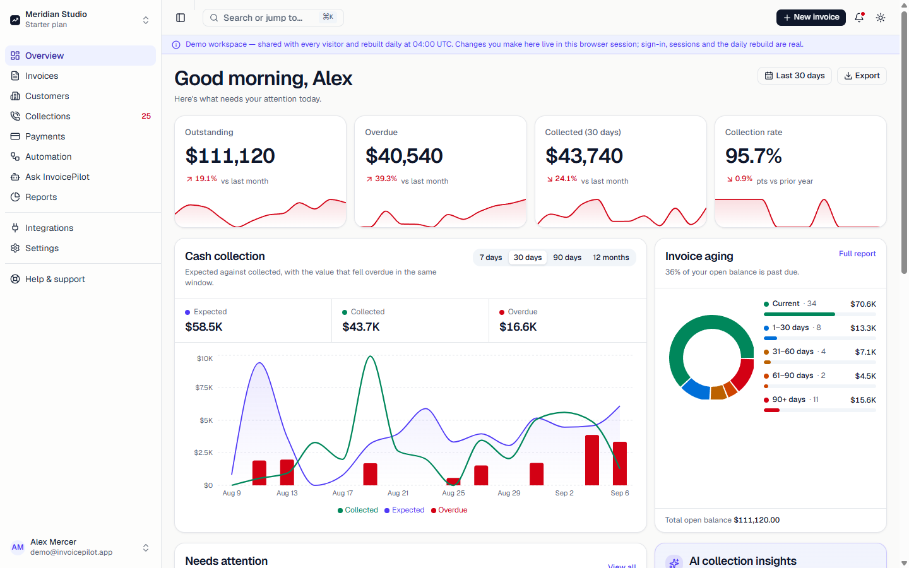
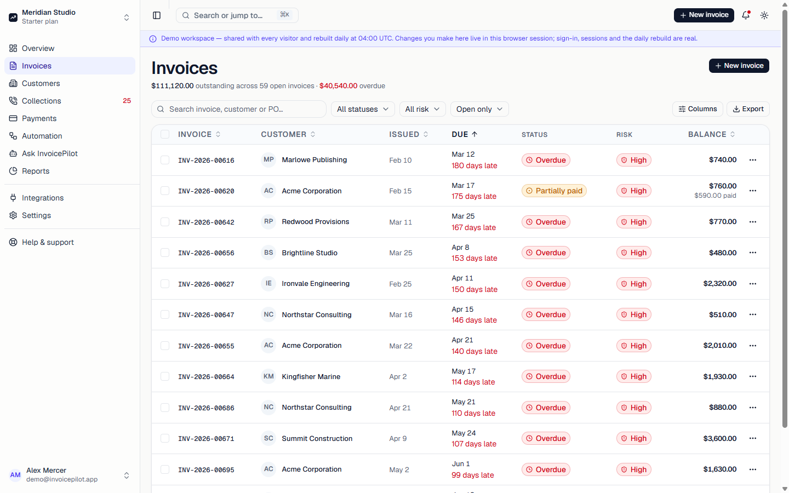
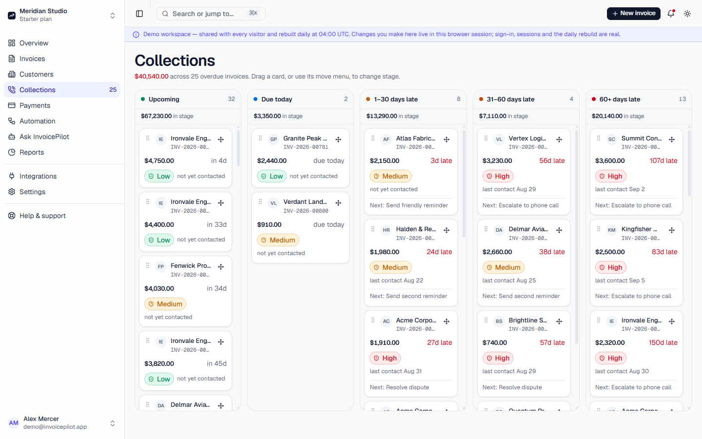

# InvoicePilot

An accounts-receivable console: invoices, a collections pipeline, reminder automations, and cash-flow reporting, built for a small finance team chasing money that customers owe them.

## Live demo

**[invoicepilot-three.vercel.app/demo](https://invoicepilot-three.vercel.app/demo)** — no signup, no form. One click into a seeded workspace.

The API runs on a free-tier instance that suspends after fifteen minutes idle, so the first load of the day takes about 25 seconds while it wakes up (measured cold start: 21.8 seconds). The `/demo` page shows that wait rather than hiding it. A visit that lands on the marketing site first pays none of it — the API is warmed in the background while you read.

## Screenshots





## What is real, and what is fixtures

| Layer | Status |
|---|---|
| Signup, login, refresh-token rotation | Real — runs against Postgres |
| Workspace scoping, permissions | Real |
| Daily demo rebuild (`/api/cron/reseed`) | Real — a Vercel cron hits a Render endpoint that reseeds Neon |
| Dashboard, invoices, customers, collections, reports, automations | Fixtures — a deterministic ledger generated in `src/lib/data/seed.ts` |

Marking a row paid, sending a reminder, dragging a collections card — every action visibly changes the screen, through the same pure function (`src/lib/data/mutate.ts`) that will become the optimistic update once those screens read from the API instead of the seed. None of it survives a reload yet. The demo banner says this on every page; a demo that hides its own seams is a worse demo than one that states its ceiling plainly.

## Architecture

```
Next.js (Vercel) ──▶ Express (Render) ──▶ Postgres (Neon)
```

Three free tiers, chosen deliberately, each with a real cost:

- **Vercel Hobby.** 60-second function ceiling (`maxDuration`), and crons run at most once a day — which is why the demo workspace rebuilds nightly rather than continuously.
- **Render free web service.** Suspends after 15 minutes idle; waking it measured 21.8 seconds. The `/demo` route's server action and the `/api/warm` warm-up route both declare `maxDuration = 60` to survive that wake inside Vercel's ceiling.
- **Neon free Postgres.** Suspends after 5 minutes idle; a `/health` check from Render's own cold start typically wakes it first.

The demo workspace is rebuilt nightly by `GET /api/cron/reseed` — a Vercel cron authenticated with `CRON_SECRET`, forwarding to Render's `POST /api/admin/reseed`, which truncates and reseeds one fixed workspace in Neon.

## Decisions worth defending

**A token-only design system.** No component hardcodes a colour; every value routes through the semantic tokens in [`design-system/invoicepilot/MASTER.md`](design-system/invoicepilot/MASTER.md). Status is never colour alone — a badge always pairs colour with an icon and a word, for readers who cannot distinguish the colour at all.

**One module builds a URL.** [`src/lib/api/client.ts`](src/lib/api/client.ts) is the only place in the frontend that knows the backend's base path. Every page and action calls a function; none of them concatenates a route. Changing the API's shape is a one-file change, not a grep across `src/app`.

**Refresh rotation lives in exactly one place.** Next.js forbids writing cookies during a Server Component render, so token refresh has to happen somewhere else in the request lifecycle. [`src/proxy.ts`](src/proxy.ts) is that place: it optimistically checks for a session cookie, rotates an expired access token before a protected page ever renders, and does nothing else — no authorization decisions, no database calls, because it runs on every navigation including prefetches.

**The deterministic ledger asserts its own invariants.** [`src/lib/data/verify.ts`](src/lib/data/verify.ts) checks that every invoice's line items sum to its total, that balances sit inside `0..amount`, that a paid invoice carries no balance — in development, on every dashboard load. The seed data is the one piece of real logic behind the fixtures; if it drifted, every screen would lie in a plausible-looking way without this.

## Running it locally

Prerequisites: Node 22.18+, a local Postgres database.

```bash
npm install
cp .env.example .env.local   # fill in API_BASE_URL and friends

cd backend
npm install
cp .env.example .env
npm run migrate
npm run seed                  # prints a demo workspace id and login

cd ..
npm run dev                   # frontend on :3000, expects the backend on :3001
```

Leave `DEMO_EMAIL` / `DEMO_PASSWORD` unset locally and `/demo` says the demo is unavailable rather than failing; set them to the seeder's output to exercise the one-click flow.

## Tests and CI

```bash
npm test              # frontend: node --test against src/lib/data/mutate.ts
cd backend && npm test # backend: node --test against the API and the seeder's invariants
```

CI ([`.github/workflows/ci.yml`](.github/workflows/ci.yml)) runs two independent jobs on every push and pull request:

- **`frontend`** — `tsc --noEmit`, `next build`, then the test above, on Node 24 (unflagged TypeScript type stripping under `node --test` needs 22.18+).
- **`backend`** — the full suite against a real Postgres service container, on Node 22.

Last measured locally: 42 routes (`npm run build`'s route table), 7 frontend tests, 385 backend tests across 62 suites.
